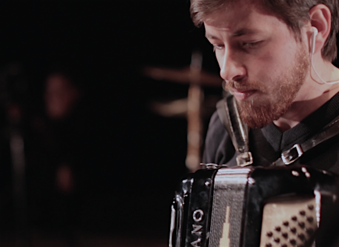

Davi Raubach studied music composition at the Federal University of Pelotas (Bachelor of Music 2012-17), and concluded his master program in 2019 under the guidance of Felipe de Almeida Ribeiro at the Federal University of Paraná. He followed composition and analysis seminars with various composers including Januibe Tejera, Flo Menezes, Maurício Dottori and Cort Lippe. Raubach is part of the CIM (*Círculo de Invenção Musical*), a group of young composers, and his compositions have been performed around the group activities. He also integrated the *Insólita Assemble*, in which worked with improvised performances mixing dance, visual art, and music. His piece Essay on Curtains (2018) was selected and performed in Argentina on the *Jornadas de Audio y Acústica en Salta* open call (2019).

Simultaneously but not independently, he has dedicated his time on songwriting, choir conduction and arrangement, accordion playing, and music teaching. He teaches music for kids at Alfredo Simon School, Pelotas-RS.

